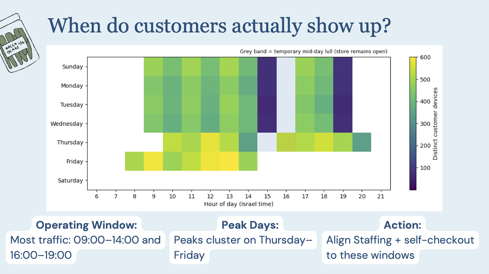
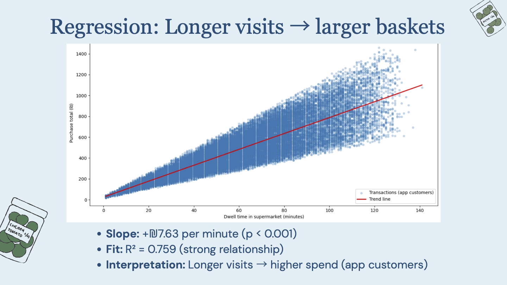

# Shefa Issachar Supermarkets — Analytics Project

**Context:** End-to-end analytics project (SQL, metrics, segmentation, regression + dashboard) using Shefa Issachar supermarket and geolocation datasets. All SQL, analysis, visuals, and write-up are my own.

## Highlights

## What’s in this repo
- **/docs/**
  - Project document / report (PDF)
  - Presentation (PDF)
  - SQL script (PDF)
  - Looker dashboard export (PDF)
- **/assets/**
  - Slide screenshots / key visuals used in this README
- **/sql/**
  - BigQuery SQL script used for the analysis (optional: add later as .sql)

## Summary
This project analyzes sales behavior, store performance, customer segmentation, and operational patterns to produce actionable recommendations, supported by a small regression component and a dashboard view.

## Deliverables
- Project Document (PDF): `docs/Shefa_Issachar_supermarkets_Project Document.pdf`
- Presentation (PDF): `docs/Shefa_Issachar_supermarkets_Presentation.pdf`
- SQL Script (PDF): `docs/Shefa_Issachar_supermarkets_SQL_Script.pdf`
- Dashboard (PDF): `docs/Shefa_Issachar_Looker_Dashboard.pdf`

## Tools
- BigQuery (SQL)
- Data analysis + visuals (presentation/report)
- Looker Studio (dashboard)
